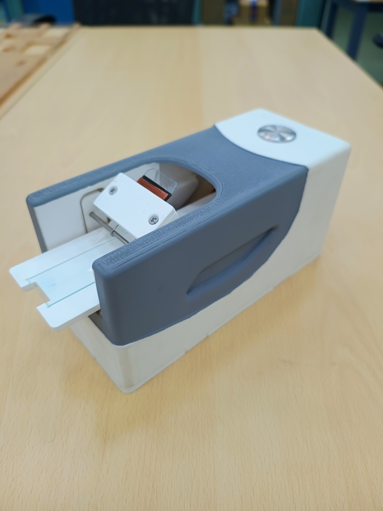
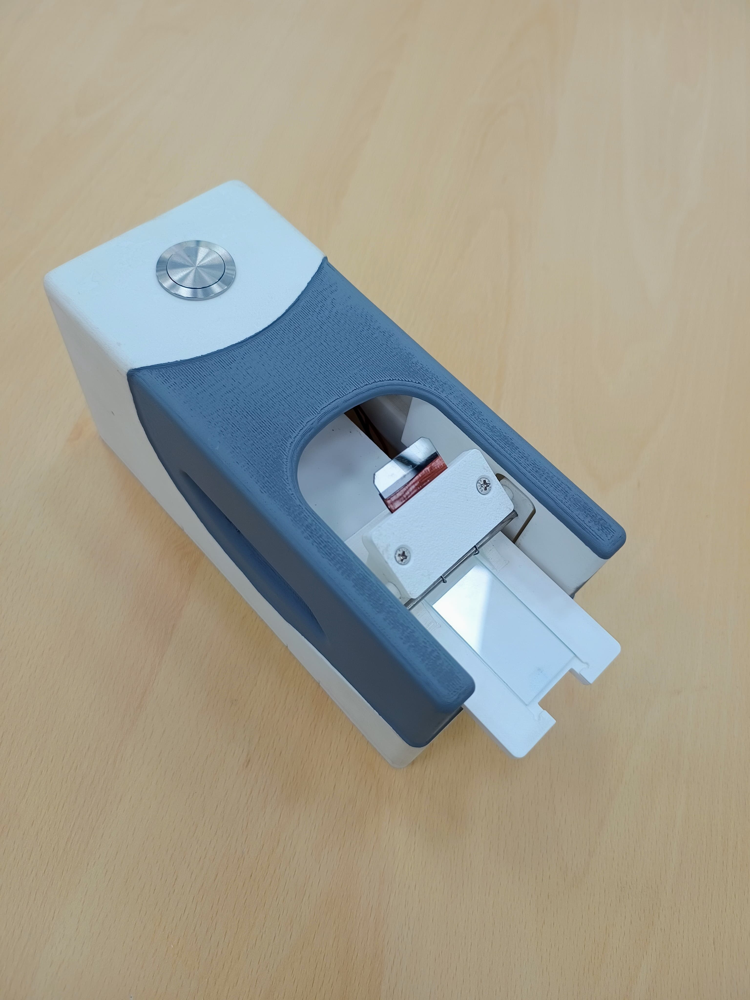
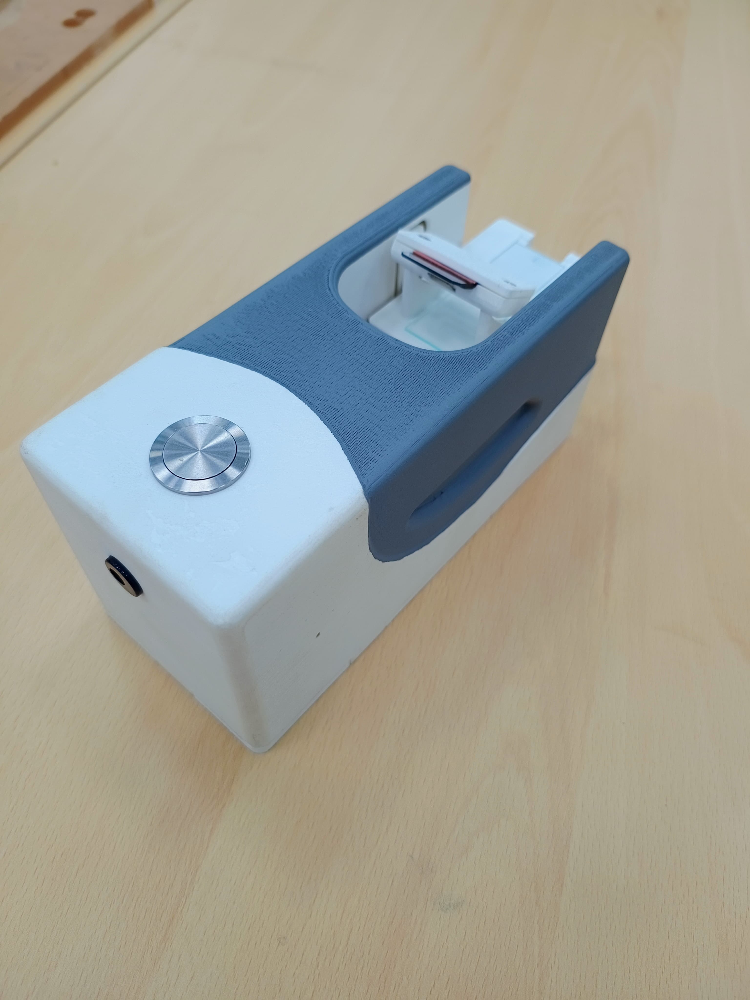

# SmearBot — Automated Smearing Device (Arduino)

- [SmearBot — Automated Smearing Device (Arduino)](#smearbot--automated-smearing-device-arduino)
  - [Features](#features)
  - [Hardware](#hardware)
  - [Demo (contains blood)](#demo-contains-blood)

This project drives a stepper motor with a DRV8834 driver to create short, consistent smears with repeatable pressure and speed. Built on Arduino.  
It uses an optical switch for position detection, a rotary encoder for speed adjustment, and an I2C LCD display for user feedback.

  

## Features

- Hands-off Smearing
- No Striations
- Single Button Operation
- Automatic Calibration using Optimally placed Optical Switch and motor stop safety.
- User control of speed via rotary encoder (1–150 mm/s) (Will be added in Version 2).
- Live LCD feedback showing smear speed in mm/s. (Will be added in Version 2).

## Hardware

- MCU: Arduino (tested with Arduino framework)
- Driver: DRV8834 stepper motor driver
- Motor: Nema 17 stepper motor
- LCD: I2C 16x2 display
- Rotary Encoder: Controls smear speed (mm/s → RPM)
- Optical Switch: Detects position, provides stop interrupt
- Inputs: Push-button trigger

   

## Demo (contains blood)

https://github.com/user-attachments/assets/040acf06-82c9-4e96-ae75-0505489eb49c
